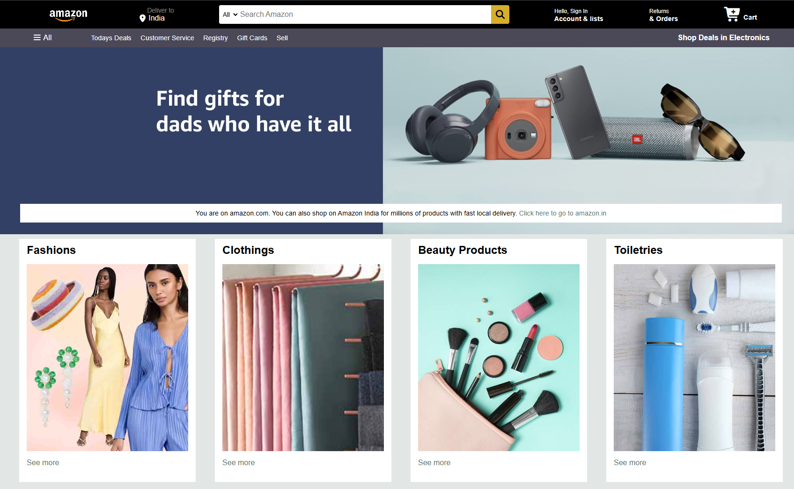

# 🛒 Amazon Homepage Clone

A **Amazon homepage clone** built with **HTML and CSS**.  
This project replicates the **UI and layout** of the Amazon landing page, featuring navigation, hero section, product grid, and footer links.

🌐 Live Demo: [View Project](https://amazon-homepage-clone-101.netlify.app/)

---

## 📸 Preview




---

## ✨ Features

- 🖼️ Pixel-perfect **Amazon-like layout** with header, hero banner, shop section, and footer.
- 🔍 Functional **search bar UI** with dropdown and hover effects.
- 📦 Product showcase grid with category cards and background images.
- 📱 Fully **responsive design** for desktop and mobile.
- 🎨 Styled with hover states, flexbox layout, and reusable components.

---

## 🛠️ Tech Stack

- **HTML5** – Structure of the page.
- **CSS3** – Styling, layout, and responsiveness.
- **Font Awesome** – For icons (search, cart, location, etc.).

---

## 📂 Project Structure

```bash
.
├── index.html         # Main homepage
├── style.css          # Styling for layout and components
├── /image             # Assets (logos, hero banner, category images)
└── README.md          # Documentation
```

## 📖 Sections Overview

Header / Navbar – Amazon logo, location, search bar, account, orders, and cart.

Hero Section – Large banner with message and CTA.

Shop Section – Category boxes (Fashion, Electronics, Furniture, etc.).

Footer – Back-to-top button, quick links, and site info.

## 🔮 Possible Improvements (Future Enhancements)

✅ Add interactivity with JavaScript (search functionality, cart updates, etc.).

✅ Improve responsiveness for all screen sizes.

✅ Add hover animations for product boxes.

✅ Implement a carousel/slider for hero section.

✅ Add dropdown menus for categories.
